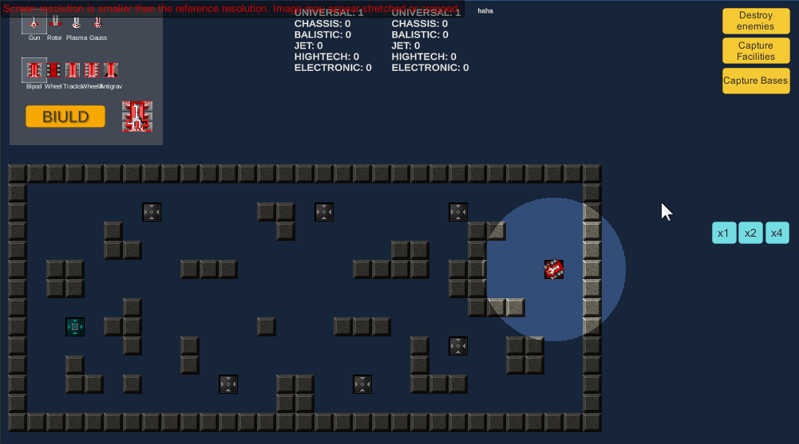

# Unity Demonstration Project

**Author: Vladislav Lobanov**

_First of all I would say this is a quick builded demo where I didn't take the time for UI and graphic overall._

There is a one of my project which is demonstrated my C# skill. This is a top-down view game demo which has the next main features:
- construct tank from different parts like chassiss and turret
- set and order for a tank (Capture facilities, destroy enemies etc.)
- set the game speed (x1, x2, x4)
- see information of captured facilities

